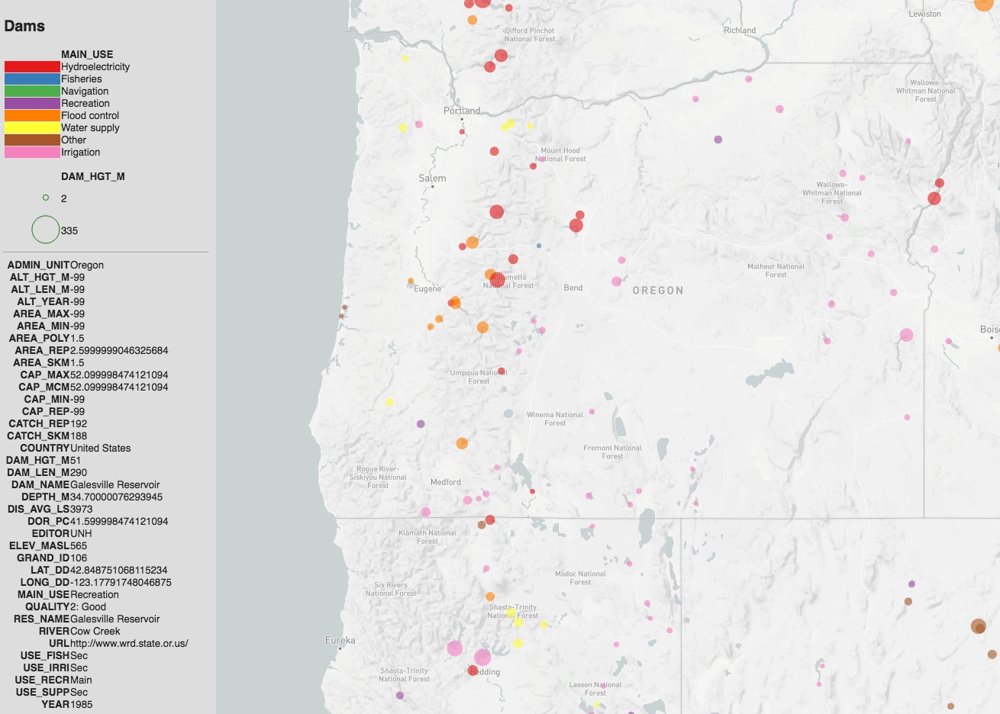

# Mapbox GL JS Template

Concept: Take geojson features on the command line and turn it into a beautiful HTML/JS map

Status: hack

# Usage

```
fio cat /data/dams.shp | gjgl.py --radius DAMHEIGHT --color MAIN_USE  --ramp BuGn
```


